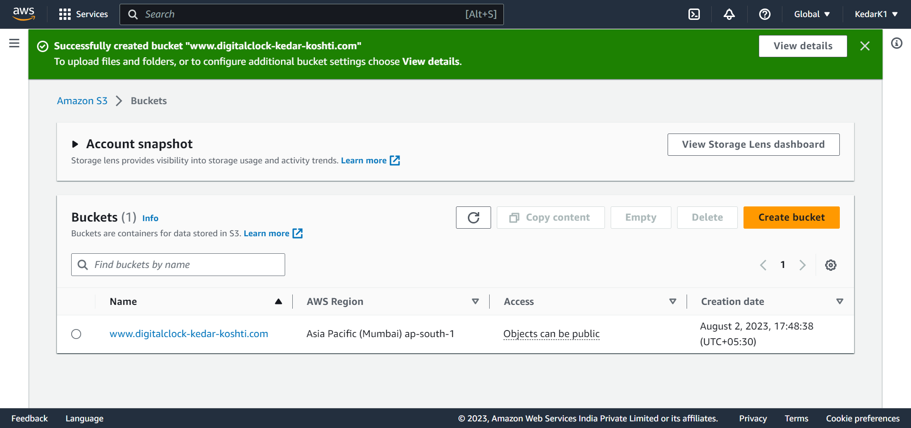
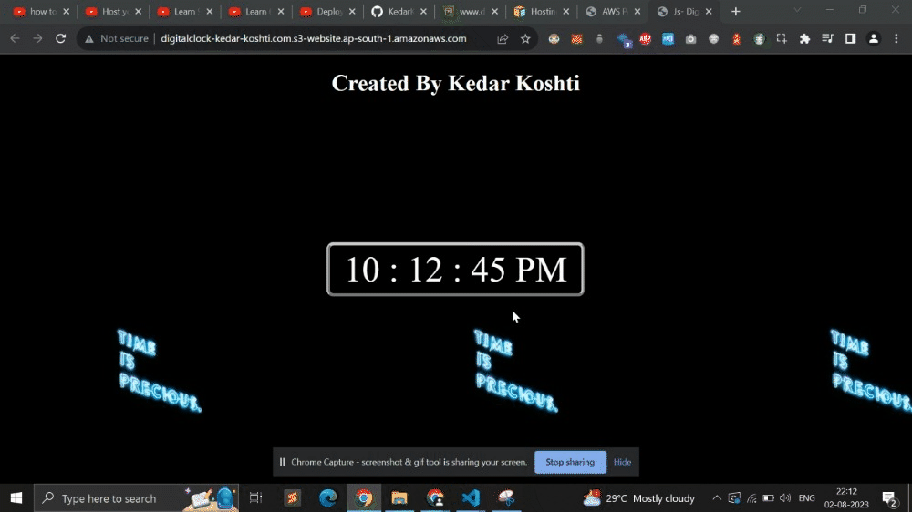

# Screenshots (WAIT FOR LOADING GIF files) - 

# Resources - 

1. https://docs.aws.amazon.com/AmazonS3/latest/userguide/WebsiteHosting.html
2. Deploying Static HTML website onto AWS || AMAZON WEB SERVICES || Deploy html page to aws ||#AWS#HTML - https://www.youtube.com/watch?v=_ris1LYN_fk
3. 

- By contrast, a dynamic website relies on server-side processing, including server-side scripts, such as PHP, JSP, or ASP.NET. Amazon S3 does not support server-side scripting, but AWS has other resources for hosting dynamic websites You can use Amazon S3 to host a static website. On a static website, individual webpages include static content. They might also contain client-side scripts.

- while you can host multiple static websites within a single S3 bucket, each website should have its own unique folder structure or subdomain to keep their files organized. Additionally, make sure to configure the correct bucket policy and CORS (Cross-Origin Resource Sharing) settings to allow access from different domains if required.

#### To delete bucket, first it is compulsary to empty bucket completely(using empty bucket congfiguration), then only you can delete the bucket