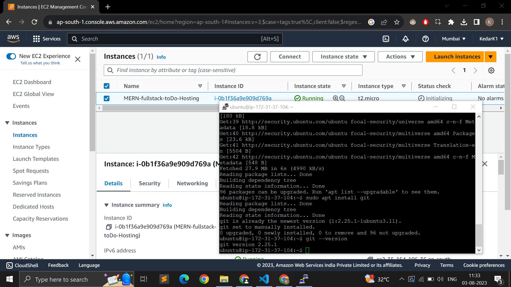
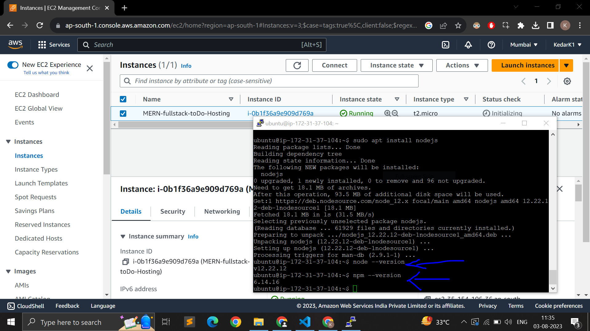

# Screenshots (WAIT FOR LOADING GIF files) - 

# What we did - 

1. We hosted our MERN stack app on AWS on EC2 VM (using PuTTy to connect to VM)
2. In 2nd attemp, we dockerized the app and then deployed it on EC2 VM
3. Use Kubernates for container orchestration, to handle the scaling part, then try to add load balancing to it 
4. Use Terraform cli to interact with aws console

# Resources - 

1. Host MERN app on EC2 - https://www.youtube.com/watch?v=xQshKLy0K4M , https://petri.com/install-git-ubuntu , https://linuxize.com/post/how-to-install-node-js-on-ubuntu-18.04/ 
2. ChatGPT😉

