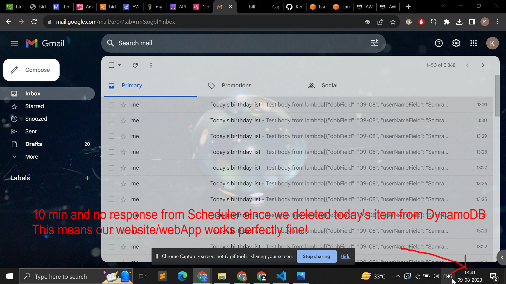

# # Screenshots (WAIT FOR LOADING 10-15 PNG files) - 

Link - https://clipchamp.com/watch/Iuuqu75ZzqQ

            
            <iframe allow="autoplay;" allowfullscreen style="border:none" src="https://clipchamp.com/watch/Iuuqu75ZzqQ/embed" width="640" height="360"></iframe>

# What we did - 
Birthday Reminder App with Email Automated - 
Deployed static website on s3 on which user can add names and DOB of people, which calls serverless lambda app through API Gateway, which adds or gets list of all people or get list of today's birthdays people. Also, we've automated this process of everyday's birthday via EventBridge Scheduler for running cron jobs that sends email about today's birthdays from the list.

<!-- 
- User: hey, i am learning aws, can i use aws serverless to create an application that have simple ui (namefield, datefield) and then run cron jobs every 1 hour to see if today is that person's borthday or not, if it is his birthday, send me on whatsapp channel about it.  

- ChatGPT: Yes, you can definitely use AWS serverless services to create such an application. AWS provides various serverless services that can help you build and deploy your application with minimal infrastructure management. Here's a high-level overview of how you can achieve this using AWS services:
Frontend (UI): You can create a simple UI with a name field and a date field using HTML, CSS, and JavaScript. You can host this static website on AWS S3 (Simple Storage Service).Backend (Serverless Functions): For the backend, you can use AWS Lambda, which is a serverless compute service. You can create a Lambda function that takes the name and birthdate as input, stores them, and checks if today is the person's birthday. You can use Node.js, Python, or other supported languages for writing the Lambda function.
Database (Optional): If you want to store the names and birthdates, you can use AWS DynamoDB, a NoSQL database service. DynamoDB is a serverless and fully managed database that will scale automatically based on your usage.
Cron Jobs (Scheduled Tasks): To run the cron jobs every hour, you can use AWS CloudWatch Events. You can create a CloudWatch Events rule to trigger the Lambda function at a specified schedule (e.g., every hour).
Messaging (WhatsApp Channel): To send messages on the WhatsApp channel, you can use the Amazon SNS (Simple Notification Service) to deliver messages to WhatsApp numbers. Note that the availability of the WhatsApp channel may vary depending on your region, as it is subject to WhatsApp Business API availability. -->

<h2>To summarize the flow:</h2>

- Users enter the name and birthdate through the UI.
- The UI calls the Lambda function to store the information in DynamoDB (if you choose to use a database).
- The CloudWatch Events trigger the Lambda function every hour.
- The Lambda function checks if today is the birthday of any stored person and sends a message using Amazon SNS to your WhatsApp number if it is their birthday.

It's worth mentioning that while serverless architectures can be highly scalable and cost-effective, they might have some limitations depending on the complexity of your application. However, for a simple application like the one you described, AWS serverless services should work well.

<!-- Remember to always check the AWS documentation and pricing details to understand the full capabilities and costs associated with each service before building your application. Good luck with your AWS learning journey! -->

<!-- Lambda Proxy Integration: When you choose a Lambda Proxy integration, the entire request and response are passed through to the Lambda function. This means that the Lambda function receives detailed information about the request, including the request headers, query parameters, path parameters, and the request body. Similarly, the Lambda function can return a detailed response, including status codes, headers, and response body. A Lambda Proxy integration allows you to have fine-grained control over the request and response processing within the Lambda function.

Lambda Non-Proxy Integration: In contrast, with a Lambda non-proxy integration, API Gateway transforms the incoming request into an event object that the Lambda function can understand, but it does not pass the full request details. The Lambda function receives a simplified event object that includes the request body and some metadata. Similarly, the Lambda function must return a simplified response object that API Gateway can understand. Lambda non-proxy integration provides some level of request and response transformation but limits the granularity of control over the request and response.

When you see the message "Are you sure you want to switch to a Lambda Proxy integration?", it usually appears when you are modifying the integration settings for an existing API endpoint and you are changing the integration type from non-proxy to proxy or vice versa. It's a confirmation message to make sure you understand that switching between the two types of integrations can have implications on how the request and response data is handled in the Lambda function.

If you are unsure about whether to switch to a Lambda Proxy integration, consider the following factors:

If you need detailed control over the request and response processing within your Lambda function, a Lambda Proxy integration may be more suitable.
If you prefer to use API Gateway's built-in request and response transformations and do not require detailed access to the request and response data, a Lambda non-proxy integration may be sufficient.
Remember that the choice between Lambda Proxy and Lambda non-proxy integration depends on the specific requirements and use case of your API. -->

<!-- 
- User
do aws serverless lambda is in py only or it is available in other languages also ? 
- ChatGPT
AWS Lambda supports multiple programming languages, not just Python. As of my knowledge cutoff in September 2021, the following languages are supported by AWS Lambda:
Node.js (JavaScript)
Python
Ruby
Java
Go
.NET Core (C#)
Custom Runtime (Allows you to use any language by providing a custom runtime API)
Since Lambda continues to evolve, there might be additional languages supported beyond the ones listed above. You can always check the AWS Lambda documentation for the most up-to-date list of supported languages. -->

- Note:
    for AWS API Gateway and other functions to work properly like here in case i have my lambda function calling up my DynamoDB instance, both have to be in same region(here i used ap-south-1 earlier when it was giving me error, it was eu-north-1 for DynamoDB instance), otherwise it will give error "Resource Not found".

# Resources - 

1. [Python] Build a CRUD Serverless API with AWS Lambda, API Gateway and a DynamoDB from Scratch - https://www.youtube.com/watch?v=9eHh946qTIk&ab_channel=FelixYu and API Authentication via API Keys | AWS API Gateway - https://www.youtube.com/watch?v=V-ac_ZvdAW4&ab_channel=FelixYu

2. AWS API Gateway to Lambda Tutorial in Python | Build a REST API - https://www.youtube.com/watch?v=uFsaiEhr1zs&ab_channel=BeABetterDev

3. https://www.youtube.com/watch?v=mQov1eetSec&ab_channel=ListenToLearn

4. DynamoDB Python GET | PUT | DELETE | SCAN | QUERY Boto3 Tutorial - https://www.youtube.com/watch?v=Al1xwYhQ-BM&ab_channel=SoumilShah

5. https://www.youtube.com/watch?v=vXiZO1c5Sk0&ab_channel=BeABetterDev

6. Schedule AWS Lambda Functions Using EventBridge and CloudWatch - https://www.youtube.com/watch?v=-ResiAcM8pg&ab_channel=AjayWadhara

