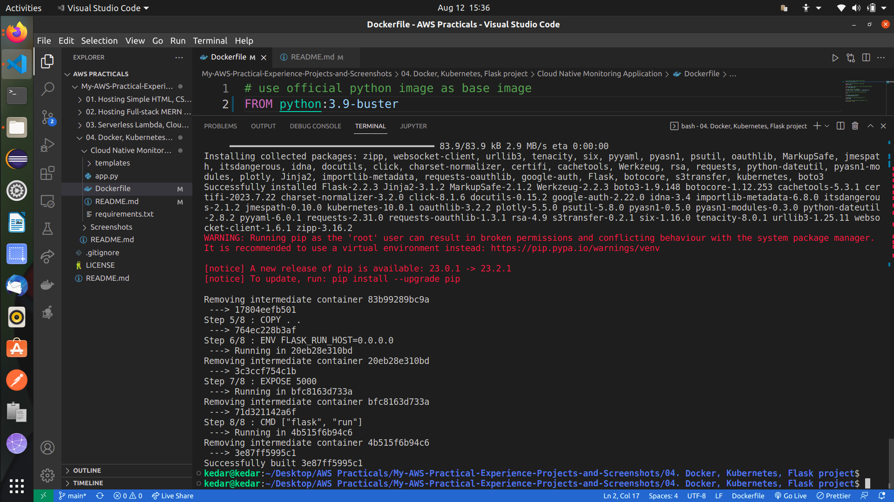

# Screenshots (WAIT FOR LOADING 10-15 PNG files) -

  

## Resources -

1. DevOps Project from scratch- Deploy Cloud Native Monitoring Application on Kubernetes (Step by Step) - https://www.youtube.com/watch?v=kBWCsHEcWnc
2. How to Install Windows Subsystem for Linux (WSL) in Windows 10 | Developer Essentials #1 - https://www.youtube.com/watch?v=GvHc8KvoVIA
3. 
