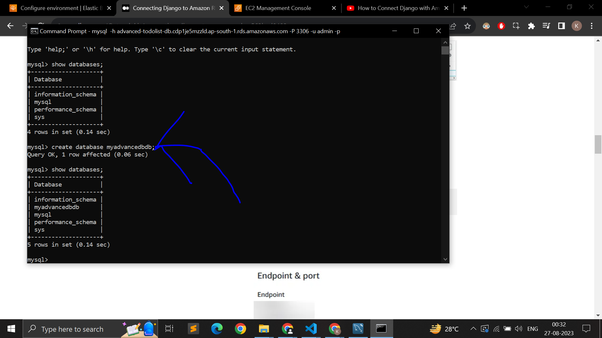
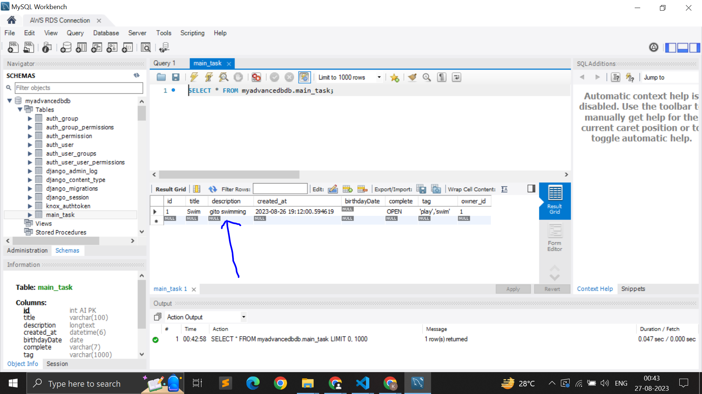

# Screenshots

1. search functionality
   

2. sort, filter functionality
   

<!-- 3. Add task functionality
    -->

<!-- 4. edit task functionality
    -->

<!-- 5. Delete task functionality
    -->

3. Delete task functionality
   

4. Delete task functionality
   

### Manage inbound rules of VPC (Virtual Private Cloud) after setting up the AWS RDS

# For Running Backend

in this very same folder
in windows type

> python manage.py runserver

in unix type

> python3 manage.py runserver

Note - backend should be running on port 8000 for backend requests

# For Running frontend

go to frontend folder by

> cd frontend

then for starting react server, type

> npm start

Note - frontend should be running on port 3000 for frontend requests

# Tech Stack Used -

Backend - DRF(Django Rest Framework)

Frontend - Reactjs

Design Libraries - Ant Design

Features/Functionalities - CRUD, Search Bar, Filter, Sorting, Pagination, Loader, Responsive(mobile-frinedly).
